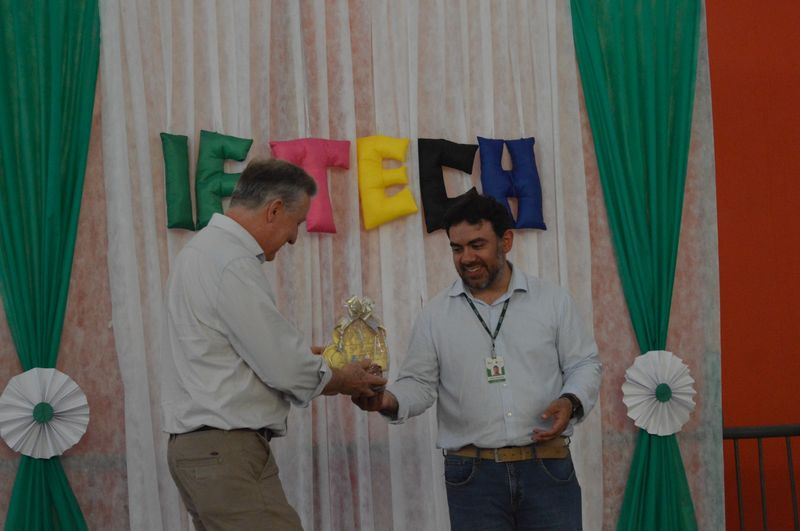
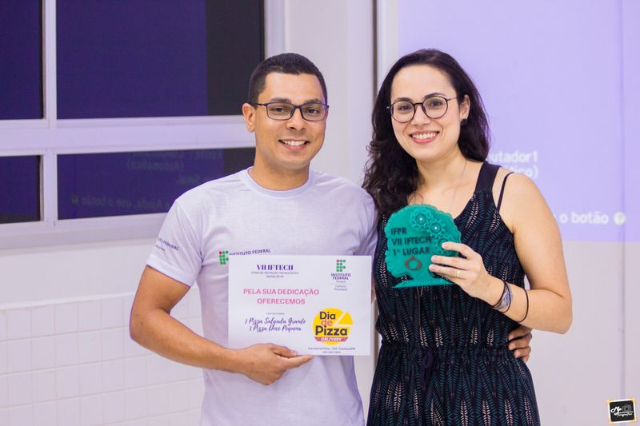

# Arquivo Histórico

## IFTECH 2025

*Professor Rafael Petermann e o Vice-Prefeito Pedro Baraldi durante a IFTECH 2025.*
**Data de realização:** 04 de novembro de 2025  
**Projetos apresentados:** 64  
**Estudantes participantes:** 148  
**Servidores orientadores:** 46  
**Membro externo:** 1 

Encontra-se disponível link com acesso de leitura aos registros fotográficos e audiovisuais do evento, permitindo consulta completa do material produzido.

[Acessar acervo completo no Google Drive](https://drive.google.com/drive/folders/1x15ibormFa2DMju0eOVi2hjLoDHpHzAZ?usp=sharing)

### Registros de Edições Anteriores

*Egresso Diego Nicácio e a Professora Camila Clozato Lara em edição anterior da IFTECH.*

Os registros fotográficos das edições anteriores da IFTECH encontram-se disponível para consulta por meio do link abaixo:

[Acessar acervo histórico](COLOCAR_LINK_AQUI)
